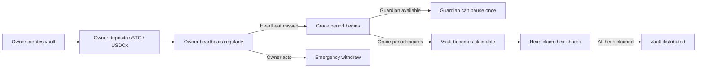

`heirloom-vault.clar` is the single Clarity 4 smart contract that powers the Heirloom inheritance vault. It handles vault creation, asset deposits, heartbeat updates, heir claims, guardian pauses, emergency withdrawal, and heir management — all in one deployed contract.

## Deployment

| Property | Value |
|----------|-------|
| Contract name | `heirloom-vault-v10` |
| Source file | `heirloom-vault.clar` |
| Language | Clarity 4 (epoch: latest) |
| Testnet deployer | `STZJWVYSKRYV1XBGS8BZ4F81E32RHBREQSE5WAJM` |
| Supported tokens | sBTC, USDCx |

## How it works

Heirloom implements a "Bitcoin heartbeat" dead-man's switch. A vault owner periodically sends a `heartbeat` transaction to prove they are alive. If the owner stops heartbeating, the vault transitions through a grace period and eventually becomes claimable by the registered heirs.

### State is computed, not stored

The vault does not persist a `state` enum on-chain. Instead, every call to `get-vault-status` derives the current state by comparing `last-heartbeat`, `heartbeat-interval`, `grace-period`, and the `guardian-pause-used` flag against the current block timestamp. This means state transitions are instant and require no separate transaction.

The four possible states are:

| State | Meaning |
|-------|---------|
| `active` | Owner is heartbeating within the configured interval |
| `grace` | Heartbeat missed; grace period is running |
| `claimable` | Grace period (and any guardian pause) has elapsed; heirs can claim |
| `distributed` | All heirs have claimed, or owner called emergency-withdraw |

## Single-contract architecture

All vault logic lives in one contract:

- **Creation** — `create-vault` initializes vault parameters and heir splits.
- **Deposits** — `deposit-sbtc` and `deposit-usdcx` fund the vault.
- **Heartbeat** — `heartbeat` resets the liveness timer.
- **Claims** — `claim` distributes a proportional share to a registered heir.
- **Guardian pause** — `guardian-pause` extends the deadline once during the grace period.
- **Emergency withdrawal** — `emergency-withdraw` returns all assets to the owner.
- **Heir management** — `update-heirs` replaces the heir list at any time.

<Note>
Because Stacks does not allow overwriting deployed contracts, future upgrades are deployed under a new name (e.g. `heirloom-vault-v11`). Existing vaults continue on the version they were created with.
</Note>

## Further reading

<Columns cols={2}>
  <Card title="Data model" icon="database" href="/contract/data-model">
    On-chain maps and constants used by the contract.
  </Card>
  <Card title="Public functions" icon="code" href="/contract/public-functions">
    All write functions: signatures, parameters, and access control.
  </Card>
  <Card title="Read-only functions" icon="magnifying-glass" href="/contract/read-only-functions">
    Query vault state without sending a transaction.
  </Card>
  <Card title="Error codes" icon="triangle-exclamation" href="/contract/error-codes">
    Every error the contract can return and how to resolve it.
  </Card>
</Columns>
